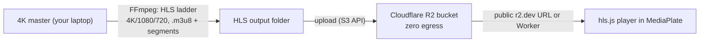

# 02 - Media pipeline (images, 4K video, posters) for ~free

Goal: host high-res / 4K images and video **outside the repo**, keep editorial quality, and
**avoid paying for streaming**. Posters come from TMDB or manual uploads.

## Where media lives today

- `site/scripts/Shared.jsx` -> `Plate`: the single image/video primitive. Today it renders only a toned gradient + grain overlay (a placeholder); its `video` prop draws play-button/duration chrome but there is **no real `<video>` anywhere**.
- `site/scripts/Gallery.jsx` -> `videos[]` of `{ title, subtitle, tone, frame, dur, ratio }`, each a `Plate`.
- `site/scripts/Archive.jsx` -> photo grid + review reel + a video teaser, all `Plate` placeholders. Review items have no `poster` field yet.
- `site/scripts/Bio.jsx` -> the one real image: ``.
- `site/image-slot.js` -> a design-time drop-in placeholder that stores base64 in a JSON sidecar. **Not** for 4K hosting (1200px cap, base64 bloat). Leave it for prototyping.

So there is exactly one integration surface to extend: `Plate` -> a `MediaPlate` that can show a real image or video while preserving grain, earth-tone letterbox, `2px` radius, locked aspect ratios, and lazy-loading.

## Video - the free, open-source route (recommended)

The pattern proven in the wild (e.g. "15 TB of 4K delivered for ~$2/mo"):

1. **Encode locally with FFmpeg** (free): produce an adaptive-bitrate HLS ladder (e.g. 4K + 1080p + 720p) as an `.m3u8` playlist plus `.ts`/fMP4 segments. Encoding on your own machine means **no transcoding server at all**.
2. **Store on Cloudflare R2** (free 10 GB, then $0.015/GB-mo, **zero egress**). Upload via the S3-compatible API or dashboard.
3. **Play with hls.js** (free, OSS) inside `MediaPlate`: adaptive bitrate, so viewers on slow connections do not buffer and 4K only streams to those who can take it.
4. Set correct MIME types (`application/vnd.apple.mpegurl` for `.m3u8`, `video/mp2t` for `.ts`) on the bucket/Worker.

Cost: storage only, effectively a few dollars/month even for a large 4K catalog; **delivery is free** because R2 does not charge egress.

Optional later: if you ever want hands-off encoding, a small FFmpeg + queue server (the OSS
"self-stream" pattern) on a ~$6-40/mo VPS, or a managed host (below). Not needed to start.

### Managed video alternative (costs money)

| Option | Pricing shape | When to pick |
|---|---|---|
| Cloudflare Stream | ~$5/1,000 min stored, ~$1/1,000 min delivered | Want a turnkey player + encoding, simple pricing |
| Mux | Per-minute encode + store + deliver | Best analytics/player; cost scales with views |

Tradeoff vs Route A: zero encoding effort and a polished player, but recurring per-minute cost
and vendor lock-in. Against your "no paid streaming" goal, these are the fallback, not default.

## Images - same bucket, optimized delivery

- Store high-res stills on the same **R2** bucket (zero egress).
- Serve responsive sizes one of two ways: (a) pre-export a few widths with a script at upload time, or (b) resize at the edge with a small **Cloudflare Worker** / Image Resizing so one master yields any width with `format=auto,quality=auto`.
- `MediaPlate` renders `` with the grain overlay on top and the earth-tone gradient as the loading/letterbox background, preserving the look.

Managed alternative: Cloudinary (free credits, strong transforms) or Sanity's built-in image
CDN if you choose Sanity for writing.

## Posters - TMDB + manual stills

Two complementary sources for the Archive (reviews) and galleries:

### TMDB API (movie / TV posters) - free, attribution required

- Free for **non-commercial** use with an API key; posters served from TMDB's image CDN (`image.tmdb.org/t/p/<size>/<path>.jpg`) at multiple widths.
- Workflow: store a `tmdbId` (or poster path) on each review record; build the image URL at render time. No files to host.
- Required attribution: show an approved TMDB logo and the notice "This product uses TMDB and the TMDB APIs but is not endorsed, certified, or otherwise approved by TMDB" in an About/Credits area. Logo must be less prominent than your own branding.
- Caveat: closed-source API; commercial use needs a separate license. Keep a small attribution credit (fits the magazine's masthead/credits aesthetic).

### Manual stills (ShotDeck-style frames, custom photography)

- For frames or photos you collect yourself, upload to **R2** and reference by URL in the gallery/archive record. You own these; no per-asset fee, zero egress.
- Be mindful of source rights for third-party film stills you did not capture; safest are your own photos/screens you have the right to publish.

## Design constraints any media component must keep

From `STYLE.md` / `Shared.jsx` / `app.css`:

- Grain overlay (`.grain-field`) on top of real imagery.
- Earth-tone gradient as fallback/letterbox; `--radius: 0`, plates max `2px` softening.
- No drop shadows on plates; hover = slight lift, no scale/glow.
- Aspect ratios locked per context (Gallery 16/9, 4/3, 3/4, 1/1; Archive 3/4, 1/1, 4/5, 16/9; Work 5/4; Notes 4/3; Bio 4/5).
- Add `loading="lazy"` + `decoding="async"` for images; video `preload="none"` + poster first, click-to-play (no autoplay sound). None of this exists yet, all additive.

## Tradeoff summary

| Approach | Cost | Quality (4K) | Effort to publish | Ops burden | Lock-in |
|---|---|---|---|---|---|
| R2 + FFmpeg + hls.js (video) | ~$0-few/mo | Excellent (you set CRF) | Encode locally, upload | Low-med (manual encode) | None |
| Cloudflare Stream / Mux (video) | $$ per view | Excellent | Drag-drop upload | None | Yes |
| R2 (images) | ~$0 | Excellent | Upload | Low | None |
| Cloudinary / Sanity (images) | Free->$$ | Excellent | Upload | None | Some |
| TMDB (posters) | Free (non-commercial) | Good | Store an id | None | API closed |
| Manual stills on R2 | ~$0 | Yours | Upload | Low | None |

## Recommendation for your goal

**Cloudflare R2 + FFmpeg + hls.js** for both video and images, **TMDB** for film/TV posters,
**manual uploads to R2** for your own stills. This is the near-zero-cost, self-owned path that
still delivers real 4K. Keep Stream/Mux noted as the convenience upgrade if encoding ever
becomes a chore. See doc 03 for how `MediaPlate` and a small config wire this into the site.
